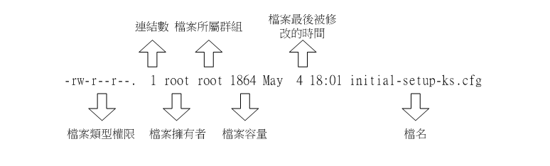
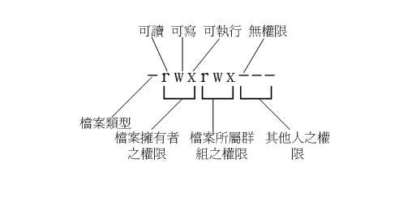

# Linux File 文件

## Linux 文件

linux下“一切皆文件”是Unix/Linux的基本哲学之一。

`普通文件`、`目录`、`字符设备`、`块设备`和`网络设备`等在Unix/Linux都被当做文件来对待。
虽然他们的类型不同，但是linux系统为它们提供了一套统一的操作接口。

Linux一般将文件可存取的身份分为三个类别，分别是 `拥有者owner(u)/组group(g)/其他others(o)`.  
以上三种身份各有 `可读read(4)/可写write(2)/可执行execute(1)` 权限。


### Linux文件属性

既然要了解Linux的文件属性，那么先使用ls命令来查看root用户的home目录下的一些文件属性：

```sh
[root@study ~]# ls -al
total 48
dr-xr-x---.  5    root     root    4096  May 29 16:08 .
dr-xr-xr-x. 17    root     root    4096  May  4 17:56 ..
-rw-------.  1    root     root    1816  May  4 17:57 anaconda-ks.cfg
-rw-r--r--.  1    root     root     176  Dec 29  2013 .bash_profile
-rw-r--r--.  1    root     root     176  Dec 29  2013 .bashrc
drwxr-xr-x.  3    root     root      17  May  6 00:14 .config               
-rw-r--r--.  1    root     root    1864  May  4 18:01 initial-setup-ks.cfg  
[    1    ][ 2 ] [  3  ]  [ 4 ]  [  5  ] [    6     ] [       7          ]
[  权限   ][链接] [拥有者] [群组] [文件大小][ 修改日期 ] [      文件名       ]
```
<!--  -->


### 文件的类型
第一个字符代表这个文件是“`目录`、`文件`或`链接文件`等等”：
* `d` 代表目录 `directory` ，例如上表文件名为“.config”的那一行中：`d`r-xr-x---；
* `-` 代表文件，例如上表文件名为“initial-setup-ks.cfg”那一行中：`-`rw-r--r--；
* `l` 代表链接文件 `link file` ；
* `b` 代表设备文件里面的可供储存的周边设备（可随机存取设备） `block device`；
* `c` 代表设备文件里面的序列埠设备，例如键盘、鼠标（一次性读取设备）。


### 文件的权限
接下来的字符中，以三个为一组，且均为“rwx” 的三个参数的组合。

权限rwx所代表的意思
* `r (Read 4)`：可读取此一文件的实际内容，如读取文本文件的文字内容等；
  * 目录的读权限可以理解为查看目录内文件列表的权限
* `w (Write 2)`：可以编辑、新增或者是修改该文件的内容（但不含删除该文件）；
* `x (eXecute 1)`：该文件具有可以被系统执行的权限。

要注意的是，这三个权限的位置不会改变，如果没有权限，就会出现减号[ `-` ]。
以`initial-setup-ks.cfg`那个文件为例: `-rw-r--r--.`
* 第一位 `-` 表示该项是一个普通文件；
* 第一组 `rw-` 为“`文件拥有者可具备的权限`”，该文件的拥有者可以读写，但不可执行；
* 第二组 `r--` 为“`加入此群组的其他用户的权限`”，用户组可读，不可写，不可执行；
* 第三组 `r--` 为“`非本人且没有加入本群组的其他帐号的权限`”，其他用户可读，不可写，不可执行。
* 第四组 `.` 一般为一个英文点号，代表 文件访问控制列表 FACL(file access control list)

文件的user, group和others的权限也可以使用数字来表示，举例来说：
* 文件的权限为 `rwx rwx r--` ，那么对应的权限为 `4+2+1 4+2+1 4+0+0` 即 `774`
* 文件的权限为 `rw- r-- r--` ，那么对应的权限为 `4+2+0 4+0+0 4+0+0` 即 `644`



PS:
1. 以 `.` 为开头命名的文件为Linux下的隐藏文件，一般不显示出来。
2. Linux下文件不像Windows那样需要一个扩展名。


### 文件的时间
每个文件都会有三个时间记录
1. Access Time: 最后一次访问文件的时间
2. Modify Time: 最后一次修改文件的时间
3. Change Time: 最后一次修改属性的时间

```sh
[root@RHEL7CCIE ~]# stat .bashrc
  File: ‘.bashrc’
  Size: 176             Blocks: 8          IO Block: 4096   regular file
Device: fd00h/64768d    Inode: 71367894    Links: 1
Access: (0644/-rw-r--r--)  Uid: (    0/    root)   Gid: (    0/    root)
Context: system_u:object_r:admin_home_t:s0
Access: 2020-09-07 11:27:07.904102466 +0800
Modify: 2013-12-29 10:26:31.000000000 +0800
Change: 2020-07-07 16:20:35.916000000 +0800
 Birth: -
[root@RHEL7CCIE ~]#
```


## Linux文件、文件系统

1.	Linux 以一组通用对象的角度看待所有文件系统。这些对象是超级块（superblock）、inode、dentry 和文件。
    1. 超级块在每个文件系统的根上，超级块描述和维护文件系统的状态。
    2. 文件系统中管理的每个对象（文件或目录）在 Linux 中表示为一个 inode。inode 包含管理文件系统中的对象所需的所有元数据（包括可以在对象上执行的操作）。
    3. 另一组结构称为 dentry，它们用来实现名称和 inode 之间的映射，有一个目录缓存用来保存最近使用的 dentry。dentry 还维护目录和文件之间的关系，从而支持在文件系统中移动。
    4. 最后，VFS 文件表示一个打开的文件（保存打开的文件的状态，比如写偏移量等等）。
2.	linux系统中的/proc文件系统有什么用？		
    1. /proc文件系统是一个基于内存的文件系统，其维护着关于当前正在运行的内核状态信息，其中包括CPU、内存、分区划分、I/O地址、直接内存访问通道和正在运行的进程。  
    2. 这个文件系统所代表的并不是各种实际存储信息的文件，它们指向的是内存里的信息。/proc文件系统是由系统自动维护的。


## 常见的Linux压缩文件扩展名

| 名称      | 解释                                                                                      |
| --------- | ----------------------------------------------------------------------------------------- |
| *.Z       | compress压缩的文件（已经被gzip替代）                                                      |
| *.gz      | gzip程序压缩的文件                                                                        |
| *.bz2     | bzip2程序压缩的文件（比gzip效果好，但只能针对一个文件来压缩）                             |
| *.tar     | tar程序打包的数据，没有压缩（使用tar打包成一个文件，可以解决bzip2不能压缩多个文件的问题） |
| *.tar.gz  | tar程序打包的数据，并经过gzip的压缩                                                       |
| *.tar.bz2 | tar程序打包的数据，并经过bzip2的压缩                                                      |
|           |                                                                                           |
|           |                                                                                           |


## 常见的硬件设备及其文件名称

udev 服务一般会管理接入系统的设备，并为其命名。
系统内核中的udev设备管理器会自动把硬件名称规范起来，目的是让用户通过设备文件的名字可以猜出设备大致的属性以及分区信息等；这对于陌生的设备来说特别方便。另外，udev设备管理器的服务会一直以守护进程的形式运行并侦听内核发出的信号来管理/dev目录下的设备文件。

| 硬件设备      | 文件名称           |
| ------------- | ------------------ |
| IDE设备       | /dev/hd[a-d]       |
| SCSI/SATA/U盘 | /dev/sd[a-p]       |
| 软驱          | /dev/fd[0-1]       |
| 打印机        | /dev/lp[0-15]      |
| 光驱          | /dev/cdrom         | 
| 鼠标          | /dev/mouse         |
| 磁带机        | /dev/st0或/dev/ht0 |


国内很多Linux培训讲师以及很多知名Linux图书在讲到设备和分区名称时，总会讲错两个知识点。
1. 第一个知识点是设备名称的理解错误。很多培训讲师和Linux技术图书中会提到，比如/dev/sda表示主板上第一个插槽上的存储设备，学员或读者在实践操作的时候会发现果然如此，因此也就对这条理论知识更加深信不疑。但真相不是这样的，/dev目录中sda设备之所以是a，并不是由插槽决定的，而是由系统内核的识别顺序来决定的，而恰巧很多主板的插槽顺序就是系统内核的识别顺序，因此才会被命名为/dev/sda。大家以后在使用iSCSI网络存储设备时就会发现，明明主板上第二个插槽是空着的，但系统却能识别到/dev/sdb这个设备就是这个道理。
2. 第二个知识点是对分区名称的理解错误。很多Linux培训讲师会告诉学员，分区的编号代表分区的个数。比如sda3表示这是设备上的第三个分区，而学员在做实验的时候确实也会得出这样的结果，但是这个理论知识是错误的，因为分区的数字编码不一定是强制顺延下来的，也有可能是手工指定的。因此sda3只能表示是编号为3的分区，而不能判断sda设备上已经存在了3个分区。


## 硬盘分区

硬盘设备是由大量的扇区组成的，每个扇区的容量为512字节。其中第一个扇区最重要，它里面保存着主引导记录与分区表信息。就第一个扇区来讲，主引导记录需要占用446字节，分区表为64字节，结束符占用2字节；其中分区表中每记录一个分区信息就需要16字节，这样一来最多只有4个分区信息可以写到第一个扇区中，这4个分区就是4个主分区。

现在，问题来了—第一个扇区最多只能创建出4个分区？于是为了解决分区个数不够的问题，可以将第一个扇区的分区表中16字节（原本要写入主分区信息）的空间（称之为扩展分区）拿出来指向另外一个分区。也就是说，扩展分区其实并不是一个真正的分区，而更像是一个占用16字节分区表空间的指针—一个指向另外一个分区的指针。这样一来，用户一般会选择使用3个主分区加1个扩展分区的方法，然后在扩展分区中创建出数个逻辑分区，从而来满足多分区（大于4个）的需求。当然，就目前来讲大家只要明白为什么主分区不能超过4个就足够了。主分区、扩展分区、逻辑分区可以像图6-4那样来规划。

所谓扩展分区，严格地讲它不是一个实际意义的分区，它仅仅是一个指向下一个分区的指针，这种指针结构将形成一个单向链表。


