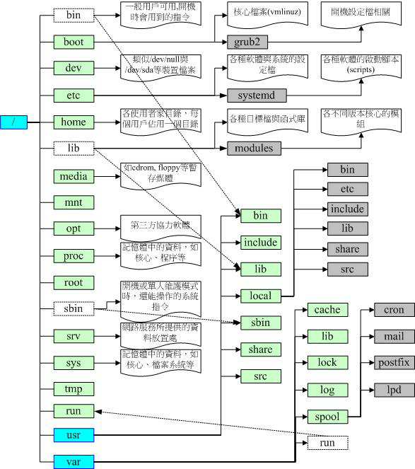

# Linux File 文件


## Linux 目录及目录树

### 根目录 /

根目录是整个系统最重要的一个目录，因为不但所有的目录都是由根目录衍生出来的，同时根目录也与开机/还原/系统修复等动作有关。   
由于系统开机时需要特定的开机软件、核心文件、开机所需程序、函数库等等文件数据，若系统出现错误时，根目录也必须要包含有能够修复文件系统的程序才行。  
FHS (Filesystem Hierarchy Standard) 建议：根目录（/）所在分区应该越小越好， 且应用程序所安装的软件最好不要与根目录放在同一个分区内，保持根目录越小越好。 如此不但性能较佳，根目录所在的文件系统也较不容易发生问题。


### 目录树（directory tree）
在Linux下面，所有的文件与目录都是由根目录开始的！那是所有目录与文件的源头。
然后再一个一个的分支下来，有点像是树枝状。因此，我们也称这种目录配置方式为："目录树（directory tree）"   

**目录树主要的特性有：**
* 目录树的起点为根目录 （/, root）；
* 每一个目录不止能使用本地分区，也可以使用网络上的文件系统。
* 每一个文件在此目录树中的文件名（包含完整路径）都是独一无二的。

```sh
[root@RHEL7CCIE ~]# ll /
total 32
lrwxrwxrwx.   1 root root    7 Jul  7 16:12 bin -> usr/bin
dr-xr-xr-x.   3 root root 4096 Jul  7 16:31 boot
drwxr-xr-x.  19 root root 3120 Sep 23 11:19 dev
drwxr-xr-x. 132 root root 8192 Sep 23 11:19 etc
drwxr-xr-x.   8 root root   79 Sep 22 20:32 home
lrwxrwxrwx.   1 root root    7 Jul  7 16:12 lib -> usr/lib
lrwxrwxrwx.   1 root root    9 Jul  7 16:12 lib64 -> usr/lib64
drwxr-xr-x.   2 root root    6 Mar 13  2014 media
drwxr-xr-x.   2 root root    6 Mar 13  2014 mnt
drwxr-xr-x.   3 root root   15 Jul  7 16:20 opt
dr-xr-xr-x. 176 root root    0 Sep 25  2020 proc
drwxrwxrwx.  15 root root 4096 Sep 23 11:20 root
drwxr-xr-x.  34 root root 1120 Sep 23 11:19 run
lrwxrwxrwx.   1 root root    8 Jul  7 16:12 sbin -> usr/sbin
drwxr-xr-x.   2 root root    6 Mar 13  2014 srv
dr-xr-xr-x.  13 root root    0 Sep 23 11:19 sys
drwxrwxrwt.  12 root root 4096 Sep 23 11:21 tmp
drwxr-xr-x.  13 root root 4096 Jul  7 16:12 usr
drwxr-xr-x.  22 root root 4096 Sep 23 11:19 var
[root@RHEL7CCIE ~]#
```



### Linux系统中常见的目录名称以及相应内容
1. /boot
    1. 开机所需文件—内核、开机菜单以及所需配置文件等
    2. Do not edit the files in this folder
2. `/dev` 重要
    1. 以文件形式存放任何设备与接口
    2. 所有的设备都会虚拟成为设备文件
3. `/etc` 重要
    1. 配置文件
    2. 包括系统配置文件，各个服务的配置文件
4. `/home`    重要
    1. 用户主目录，普通用户
5. /bin
    1. 存放单用户模式下还可以操作的命令
    2. 普通用户执行的命令
6. /lib
    1. 开机时用到的函数库，以及/bin与/sbin下面的命令要调用的函数
    2. 不要动，一般是系统调用的
    3. 几乎日常操作也不需要动到这个目录
7. /sbin
    1. 开机过程中需要的命令
    2. 管理员使用到的命令
8. /media
    1. 用于挂载设备文件的目录
    2. 在 RHEL 5/6 中一般都是 mnt 目录
9. /opt
    1. 放置第三方的软件
10. `/root`   重要
    1. 系统管理员 root 的家目录
11. /srv
    1. 一些网络服务的数据文件目录
12. /tmp
    1. 任何人均可使用的"共享"临时目录
    2. 有 SBIT 保护位 drwxrwxrwt.  12 root root 4096 Sep 23 11:58 tmp
13. `/proc`   重要
    1. 虚拟文件系统，例如系统内核、进程、外部设备及网络状态等
14. /usr
    1.  /usr/local
        1. 用户自行安装的软件
    2.  /usr/sbin
        1. Linux系统开机时不会使用到的软件/命令/脚本
    3.  /usr/share
        1. 帮助与说明文件，也可放置共享文件
15. `/var`    重要
    1. 主要存放经常变化的文件，如日志，网站数据，数据库
    2. 文件都是按照类型保存，不是按照功能保存的
16. /lost+found
    1. 当文件系统发生错误时，将一些丢失的文件片段存放在这里


## 绝对路径与相对路径
根据文件名写法的不同，也可将所谓的路径（path）定义为绝对路径（absolute）与相对路径（relative）。 这两种文件名/路径的写法依据分别为：
* 绝对路径：由根目录（/）开始写起的文件名或目录名称， 例如 `/home/miles/.bashrc` ；
* 相对路径：相对于目前路径的文件名写法。 例如 `./home/miles` 或 `../../home/miles/` 等等，开头不是 `/` 就属于相对路径的写法

**一些特殊目录的简称：**

| 目录     | 解释                                                     |
| -------- | -------------------------------------------------------- |
| .        | 代表此层目录                                             |
| ..       | 代表上一层目录                                           |
| -        | 代表前一个工作目录                                       |
| ~        | 代表"目前使用者身份"所在的主文件夹                       |
| ~account | 代表 account 这个使用者的主文件夹（account是个帐号名称） |

在所有目录下面都会存在的两个目录，分别是"."与".." 分别代表此层与上层目录的意思。


## 文件系统格式
用户在硬件存储设备中执行的文件建立、写入、读取、修改、转存与控制等操作都是依靠文件系统来完成的。文件系统的作用是合理规划硬盘，以保证用户正常的使用需求。Linux系统支持数十种的文件系统，而最常见的文件系统如下所示。

### Ext2
RHEL4 主要使用

### Ext3
RHEL 5 主要使用

是一款日志文件系统，能够在系统异常宕机时避免文件系统资料丢失，并能自动修复数据的不一致与错误。然而，当硬盘容量较大时，所需的修复时间也会很长，而且也不能百分之百地保证资料不会丢失。它会把整个磁盘的每个写入动作的细节都预先记录下来，以便在发生异常宕机后能回溯追踪到被中断的部分，然后尝试进行修复。

### Ext4
RHEL 6 主要使用

Ext3的改进版本，作为RHEL 6系统中的默认文件管理系统，它支持的存储容量高达1EB（1EB=1,073,741,824GB），且能够有无限多的子目录。另外，Ext4文件系统能够批量分配block块，从而极大地提高了读写效率。

### XFS
RHEL 7 主要使用

是一种高性能的日志文件系统，而且是RHEL 7中默认的文件管理系统，它的优势在发生意外宕机后尤其明显，即可以快速地恢复可能被破坏的文件，而且强大的日志功能只用花费极低的计算和存储性能。并且它最大可支持的存储容量为18EB，这几乎满足了所有需求。


### super block
日常在硬盘需要保存的数据实在太多了，因此Linux系统中有一个名为super block的“硬盘地图”。

Linux并不是把文件内容直接写入到这个“硬盘地图”里面，而是在里面记录着整个文件系统的信息。因为如果把所有的文件内容都写入到这里面，它的体积将变得非常大，而且文件内容的查询与写入速度也会变得很慢。

Linux只是把每个文件的权限与属性记录在inode中，而且每个文件占用一个独立的inode表格，该表格的大小默认为128字节，里面记录着如下信息：

* 该文件的访问权限（read、write、execute）；
* 该文件的所有者与所属组（owner、group）；
* 该文件的大小（size）；
* 该文件的创建或内容修改时间（ctime）；
* 该文件的最后一次访问时间（atime）；
* 该文件的修改时间（mtime）；
* 文件的特殊权限（SUID、SGID、SBIT）；
* 该文件的真实数据地址（point）。


### inode

文件的实际内容则保存在block块中（大小可以是1KB、2KB或4KB），一个inode的默认大小仅为128B（Ext3），记录一个block则消耗4B。

当文件的inode被写满后，Linux系统会自动分配出一个block块，专门用于像inode那样记录其他block块的信息，这样把各个block块的内容串到一起，就能够让用户读到完整的文件内容了。

对于存储文件内容的block块，有下面两种常见情况（以4KB的block大小为例进行说明）。

* 情况1：文件很小（1KB），但依然会占用一个block，因此会潜在地浪费3KB。
* 情况2：文件很大（5KB），那么会占用两个block（5KB-4KB后剩下的1KB也要占用一个block）。


### VFS

计算机系统在发展过程中产生了众多的文件系统，为了使用户在读取或写入文件时不用关心底层的硬盘结构，Linux内核中的软件层为用户程序提供了一个VFS（Virtual File System，虚拟文件系统）接口，这样用户实际上在操作文件时就是统一对这个虚拟文件系统进行操作了。

从中可见，实际文件系统在VFS下隐藏了自己的特性和细节，这样用户在日常使用时会觉得“文件系统都是一样的”，也就可以随意使用各种命令在任何文件系统中进行各种操作了（比如使用cp命令来复制文件）。


