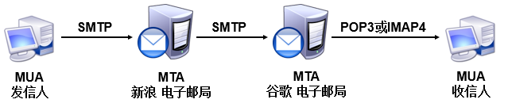
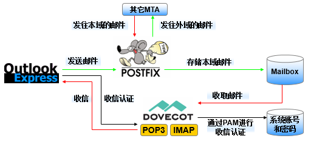

# postfix.邮件

20世纪60年代，美苏两国正处于冷战时期。美国军方认为应该在科学技术上保持其领先的地位，这样有助于在未来的战争中取得优势。美国国防部由此发起了一项名为ARPANET的科研项目，即大家现在所熟知的阿帕网计划。阿帕网是当今互联网的雏形，它也是世界上第一个运营的封包交换网络。但是很快在1971年阿帕网遇到了严峻的问题，参与阿帕网科研项目的科学家分布在美国不同的地区，甚至还会因为时差的影响而不能及时分享各自的研究成果，因此科学家们迫切需要一种能够借助于网络在计算机之间传输数据的方法。

Web服务和FTP文件传输服务也能实现数据交换，但是这些服务的数据传输方式就像“打电话”那样，需要双方同时在线才能完成传输工作。如果对方的主机宕机或者科研人员因故离开，就有可能错过某些科研成果了。好在当时麻省理工学院的Ray Tomlinson博士也参与到了阿帕网计划的科研项目中，他觉得有必要设计一种类似于“信件”的传输服务，并为信件准备一个“信箱”，这样即便对方临时离线也能完成数据的接收，等上线后再进行处理即可。于是，Ray Tomlinson博士用了近一年的时间完成了电子邮件（Email）的设计，并在1971年秋天使用SNDMSG软件向自己的另一台计算机发送出了人类历史上第一封电子邮件—电子邮件系统在互联网中由此诞生！

既然要在互联网中给他人发送电子邮件，那么对方用户用于接收电子邮件的名称必须是唯一的，否则电子邮件可能会同时发给多个重名的用户，也或者干脆大家都收不到邮件了。因此，Ray Tomlinson博士决定选择使用“姓名@计算机主机名称”的格式来规范电子信箱的名称。选择使用@符号作为间隔符的原因其实也很简单，因为Ray Tomlinson博士觉得人类的名字和计算机主机名称中应该不会有这么一个@符号，所以就选择了这个符号。

电子邮件系统基于邮件协议来完成电子邮件的传输，常见的邮件协议有下面这些。
* 简单邮件传输协议（Simple Mail Transfer Protocol，SMTP）：用于发送和中转发出的电子邮件，占用服务器的25/TCP端口。
* 邮局协议版本3（Post Office Protocol 3）：用于将电子邮件存储到本地主机，占用服务器的110/TCP端口。
* Internet消息访问协议版本4（Internet Message Access Protocol 4）：用于在本地主机上访问邮件，占用服务器的143/TCP端口。


在电子邮件系统中，为用户收发邮件的服务器名为邮件用户代理（Mail User Agent，MUA）。另外，既然电子邮件系统能够让用户在离线的情况下依然可以完成数据的接收，肯定得有一个用于保存用户邮件的“信箱”服务器，这个服务器的名字为邮件投递代理（Mail Delivery Agent，MDA），其工作职责是把来自于邮件传输代理（Mail Transfer Agent，MTA）的邮件保存到本地的收件箱中。其中，这个MTA的工作职责是转发处理不同电子邮件服务供应商之间的邮件，把来自于MUA的邮件转发到合适的MTA服务器。例如，我们从新浪信箱向谷歌信箱发送一封电子邮件，这封电子邮件的传输过程如图15-2所示。

总的来说，一般的网络服务程序在传输信息时就像拨打电话，需要双方同时保持在线，而在电子邮件系统中，当用户发送邮件后不必等待投递工作完成即可下线。如果对方邮件服务器（MTA）宕机或对方临时离线，则发件服务器（MTA）就会把要发送的内容自动的暂时保存到本地，等检测到对方邮件服务器恢复后会立即再次投递，期间一般无需运维人员维护处理，随后收信人（MUA）就能在自己的信箱中找到这封邮件了。



大家在生产环境中部署企业级的电子邮件系统时，有4个注意事项请留意。
1. 添加反垃圾与反病毒模块：它能够很有效地阻止垃圾邮件或病毒邮件对企业信箱的干扰。
2. 对邮件加密：可有效保护邮件内容不被黑客盗取和篡改。
3. 添加邮件监控审核模块：可有效地监控企业全体员工的邮件中是否有敏感词、是否有透露企业资料等违规行为。
4. 保障稳定性：电子邮件系统的稳定性至关重要，运维人员应做到保证电子邮件系统的稳定运行，并及时做好防范分布式拒绝服务（Distributed Denial of Service，DDoS）攻击的准备。

一个最基础的电子邮件系统肯定要能提供发件服务和收件服务，为此需要使用基于SMTP协议的Postfix服务程序提供发件服务功能，并使用基于POP3协议的Dovecot服务程序提供收件服务功能。这样一来，用户就可以使用Outlook Express或Foxmail等客户端服务程序正常收发邮件了。



* 在RHEL 5、RHEL 6以及诸多早期的Linux系统中，默认使用的发件服务是由Sendmail服务程序提供的，
* 而在RHEL 7系统中已经替换为Postfix服务程序。相较于Sendmail服务程序，Postfix服务程序减少了很多不必要的配置步骤，而且在稳定性、并发性方面也有很大改进。

一般而言，我们的信箱地址类似于“root@rhce7.com”这样，也就是按照“用户名@主机地址（域名）”格式来规范的。
如果您给我一串“root@192.168.10.10”的信息，我可能猜不到这是一个信箱地址，没准会将它当作SSH协议的连接信息。
因此，要想更好地检验电子邮件系统的配置效果，需要先部署bind服务程序，为电子邮件服务器和客户端提供DNS域名解析服务。

```sh
[root@rhce7 ~]# yum install -y bind-chroot
[root@rhce7 ~]# yum -y install postfix
[root@rhce7 ~]# yum -y install dovecot
```


## Postfix服务程序主配置文件中的重要参数
Postfix服务程序主配置文件 /etc/postfix/main.cf

| 参数            | 作用                     |
| --------------- | ------------------------ |
| myhostname      | 邮局系统的主机名         |
| mydomain        | 邮局系统的域名           |
| myorigin        | 从本机发出邮件的域名名称 |
| inet_interfaces | 监听的网卡接口           |
| mydestination   | 可接收邮件的主机名或域名 |
| mynetworks      | 设置可转发哪些主机的邮件 |
| relay_domains   | 设置可转发哪些网域的邮件 |


## instances


### 部署基础的电子邮件系统
配置服务器主机名称，需要保证服务器主机名称与发信域名保持一致：
```sh
[root@rhce7 named]# vim /etc/hostname
[root@rhce7 named]# cat /etc/hostname
mail.rhce7.com
[root@rhce7 named]# hostname
mail.rhce7.com
[root@rhce7 named]#
```

清空iptables防火墙默认策略，并保存策略状态，避免因防火墙中默认存在的策略阻止了客户端DNS解析域名及收发邮件：
```sh
[root@rhce7 ~]# iptables -F
[root@rhce7 ~]# service iptables save
iptables: Saving firewall rules to /etc/sysconfig/iptables:[  OK  ]
[root@rhce7 ~]#
```

为电子邮件系统提供域名解析
```sh
[root@rhce7 ~]# yum install -y bind-chroot
[root@rhce7 ~]# vim /etc/named.conf
[root@rhce7 ~]# cat /etc/named.conf
//
// named.conf
//
// Provided by Red Hat bind package to configure the ISC BIND named(8) DNS
// server as a caching only nameserver (as a localhost DNS resolver only).
//
// See /usr/share/doc/bind*/sample/ for example named configuration files.
//

options {
        listen-on port 53 { any; };                         # 允许任何人监听端口53
        listen-on-v6 port 53 { ::1; };
        directory       "/var/named";
        dump-file       "/var/named/data/cache_dump.db";
        statistics-file "/var/named/data/named_stats.txt";
        memstatistics-file "/var/named/data/named_mem_stats.txt";
        allow-query     { any; };                           # 允许任何主机查询DNS

        /*
         - If you are building an AUTHORITATIVE DNS server, do NOT enable recursion.
         - If you are building a RECURSIVE (caching) DNS server, you need to enable
           recursion.
         - If your recursive DNS server has a public IP address, you MUST enable access
           control to limit queries to your legitimate users. Failing to do so will
           cause your server to become part of large scale DNS amplification
           attacks. Implementing BCP38 within your network would greatly
           reduce such attack surface
        */
        recursion yes;

        dnssec-enable yes;
        dnssec-validation yes;
        dnssec-lookaside auto;

        /* Path to ISC DLV key */
        bindkeys-file "/etc/named.iscdlv.key";

        managed-keys-directory "/var/named/dynamic";

        pid-file "/run/named/named.pid";
        session-keyfile "/run/named/session.key";
};

logging {
        channel default_debug {
                file "data/named.run";
                severity dynamic;
        };
};

zone "." IN {
        type hint;
        file "named.ca";
};

include "/etc/named.rfc1912.zones";
include "/etc/named.root.key";

[root@rhce7 ~]#
```
编辑区域文件
```sh
[root@rhce7 ~]# vim /etc/named.rfc1912.zones

[root@rhce7 named]# cat /etc/named.rfc1912.zones
zone "rhce7.com" IN {
        type master;
        file "rhce7.com.zone";
        allow-update { none; };
};

[root@rhce7 named]#
```
编辑数据文件
```sh
[root@rhce7 ~]# cd /var/named/
[root@rhce7 named]# cp named.localhost rhce7.com.zone
[root@rhce7 named]# vim rhce7.com.zone
[root@rhce7 named]# chown root:named rhce7.com.zone
[root@rhce7 named]# mv rhce7.com.zone rhce7.com.zone
[root@rhce7 named]# cat rhce7.com.zone
$TTL 1D
@       IN SOA          rhce7.com.      root.rhce7.com. (
                                        0       ; serial
                                        1D      ; refresh
                                        1H      ; retry
                                        1W      ; expire
                                        3H )    ; minimum
        NS              ns.rhce7.com.
ns      IN A            192.168.123.231
@       IN MX 10        mail.rhce7.com.
mail    IN A            192.168.123.231

[root@rhce7 named]#
```
```sh
[root@rhce7 named]# systemctl restart named
[root@rhce7 named]# systemctl enable named
ln -s '/usr/lib/systemd/system/named.service' '/etc/systemd/system/multi-user.target.wants/named.service'
[root@rhce7 named]#
```

设定本机DNS 为本机。
```sh
[root@rhce7 named]# cat /etc/sysconfig/network-scripts/ifcfg-enp0s3
TYPE=Ethernet
BOOTPROTO=dhcp
DEFROUTE=yes
IPV4_FAILURE_FATAL=no
IPV6INIT=yes
IPV6_AUTOCONF=yes
IPV6_DEFROUTE=yes
IPV6_FAILURE_FATAL=no
NAME=enp0s3
UUID=8e082bc2-10a3-4b6b-9464-d4ecce6574b2
DEVICE=enp0s3
ONBOOT=yes
DNS1=192.168.123.231
PEERDNS=yes
PEERROUTES=yes
IPV6_PEERDNS=yes
IPV6_PEERROUTES=yes
[root@rhce7 named]#
```


### 配置Postfix服务程序

Postfix是一款由IBM资助研发的免费开源电子邮件服务程序，能够很好地兼容Sendmail服务程序，可以方便Sendmail用户迁移到Postfix服务上。Postfix服务程序的邮件收发能力强于Sendmail服务，而且能自动增加、减少进程的数量来保证电子邮件系统的高性能与稳定性。另外，Postfix服务程序由许多小模块组成，每个小模块都可以完成特定的功能，因此可在生产工作环境中根据需求灵活搭配它们。

#### 安装Postfix服务程序

这一步在RHEL7系统中是多余的, 系统已经安装好。
在安装完Postfix服务程序后，需要禁用iptables防火墙，否则外部用户无法访问电子邮件系统。
```sh
[root@rhce7 named]# yum -y install postfix
Loaded plugins: langpacks, product-id, subscription-manager
This system is not registered to Red Hat Subscription Management. You can use subscription-manager to register.
Package 2:postfix-2.10.1-6.el7.x86_64 already installed and latest version
Nothing to do
[root@rhce7 named]#
```

```sh
[root@rhce7 named]# systemctl disable iptables
[root@rhce7 named]#
```

#### 配置Postfix服务程序

Postfix服务程序主配置文件 /etc/postfix/main.cf

在Postfix服务程序的主配置文件中，总计需要修改5处。首先是在第76行定义一个名为myhostname的变量，用来保存服务器的主机名称。请大家记住这个变量的名称，下边的参数需要调用它：
```sh
[root@rhce7 named]# vim /etc/postfix/main.cf

 68 # INTERNET HOST AND DOMAIN NAMES
 69 #
 70 # The myhostname parameter specifies the internet hostname of this
 71 # mail system. The default is to use the fully-qualified domain name
 72 # from gethostname(). $myhostname is used as a default value for many
 73 # other configuration parameters.
 74 #
 75 #myhostname = host.domain.tld
 76 myhostname = mail.rhce7.com
[root@rhce7 named]#
```


然后在第83行定义一个名为mydomain的变量，用来保存邮件域的名称。大家也要记住这个变量名称，下面将调用它：

```sh
[root@rhce7 named]# vim /etc/postfix/main.cf

 78 # The mydomain parameter specifies the local internet domain name.
 79 # The default is to use $myhostname minus the first component.
 80 # $mydomain is used as a default value for many other configuration
 81 # parameters.
 82 #
 83 mydomain = rhce7.com
 84

[root@rhce7 named]#
```

在第99行调用前面的mydomain变量，用来定义发出邮件的域。调用变量的好处是避免重复写入信息，以及便于日后统一修改：

```sh
[root@rhce7 named]# vim /etc/postfix/main.cf

 85 # SENDING MAIL
 86 #
 87 # The myorigin parameter specifies the domain that locally-posted
 88 # mail appears to come from. The default is to append $myhostname,
 89 # which is fine for small sites.  If you run a domain with multiple
 90 # machines, you should (1) change this to $mydomain and (2) set up
 91 # a domain-wide alias database that aliases each user to
 92 # user@that.users.mailhost.
 93 #
 94 # For the sake of consistency between sender and recipient addresses,
 95 # myorigin also specifies the default domain name that is appended
 96 # to recipient addresses that have no @domain part.
 97 #
 98 #myorigin = $myhostname
 99 myorigin = $mydomain
100

[root@rhce7 named]#
```


第4处修改是在第116行定义网卡监听地址。可以指定要使用服务器的哪些IP地址对外提供电子邮件服务；也可以干脆写成all，代表所有IP地址都能提供电子邮件服务：

```sh
[root@rhce7 named]# vim /etc/postfix/main.cf

103 # The inet_interfaces parameter specifies the network interface
104 # addresses that this mail system receives mail on.  By default,
105 # the software claims all active interfaces on the machine. The
106 # parameter also controls delivery of mail to user@[ip.address].
107 #
108 # See also the proxy_interfaces parameter, for network addresses that
109 # are forwarded to us via a proxy or network address translator.
110 #
111 # Note: you need to stop/start Postfix when this parameter changes.
112 #
113 inet_interfaces = all
114 #inet_interfaces = $myhostname
115 #inet_interfaces = $myhostname, localhost
116 #inet_interfaces = localhost
117

[root@rhce7 named]#
```


最后一处修改是在第164行定义可接收邮件的主机名或域名列表。这里可以直接调用前面定义好的myhostname和mydomain变量（如果不想调用变量，也可以直接调用变量中的值）：

```sh
[root@rhce7 named]# vim /etc/postfix/main.cf

133 # The mydestination parameter specifies the list of domains that this
134 # machine considers itself the final destination for.
135 #
136 # These domains are routed to the delivery agent specified with the
137 # local_transport parameter setting. By default, that is the UNIX
138 # compatible delivery agent that lookups all recipients in /etc/passwd
139 # and /etc/aliases or their equivalent.
140 #
141 # The default is $myhostname + localhost.$mydomain.  On a mail domain
142 # gateway, you should also include $mydomain.
143 #
144 # Do not specify the names of virtual domains - those domains are
145 # specified elsewhere (see VIRTUAL_README).
146 #
147 # Do not specify the names of domains that this machine is backup MX
148 # host for. Specify those names via the relay_domains settings for
149 # the SMTP server, or use permit_mx_backup if you are lazy (see
150 # STANDARD_CONFIGURATION_README).
151 #
152 # The local machine is always the final destination for mail addressed
153 # to user@[the.net.work.address] of an interface that the mail system
154 # receives mail on (see the inet_interfaces parameter).
155 #
156 # Specify a list of host or domain names, /file/name or type:table
157 # patterns, separated by commas and/or whitespace. A /file/name
158 # pattern is replaced by its contents; a type:table is matched when
159 # a name matches a lookup key (the right-hand side is ignored).
160 # Continue long lines by starting the next line with whitespace.
161 #
162 # See also below, section "REJECTING MAIL FOR UNKNOWN LOCAL USERS".
163 #
164 mydestination = $myhostname, $mydomain
165 #mydestination = $myhostname, localhost.$mydomain, localhost, $mydomain
166 #mydestination = $myhostname, localhost.$mydomain, localhost, $mydomain,
167 #       mail.$mydomain, www.$mydomain, ftp.$mydomain
168

[root@rhce7 named]#
```


#### 创建电子邮件系统的登录账户

Postfix与vsftpd服务程序一样，都可以调用本地系统的账户和密码，因此在本地系统创建常规账户即可。最后重启配置妥当的postfix服务程序，并将其添加到开机启动项中。
```sh
[root@rhce7 named]# useradd usermail
[root@rhce7 named]# echo "Aa123456" | passwd --stdin usermail
Changing password for user usermail.
passwd: all authentication tokens updated successfully.
[root@rhce7 named]# systemctl restart postfix.service
[root@rhce7 named]# systemctl enable postfix.service
[root@rhce7 named]#
```

### 配置Dovecot服务程序

Dovecot是一款能够为Linux系统提供IMAP和POP3电子邮件服务的开源服务程序，安全性极高，配置简单，执行速度快，而且占用的服务器硬件资源也较少，因此是一款值得推荐的收件服务程序。
```sh
[root@rhce7 named]# yum -y install dovecot
```

#### 配置部署Dovecot服务程序

第24行，把Dovecot服务程序支持的电子邮件协议修改为imap、pop3和lmtp。然后在这一行下面添加一行参数，允许用户使用明文进行密码验证。
之所以这样操作，是因为Dovecot服务程序为了保证电子邮件系统的安全而默认强制用户使用加密方式进行登录，而由于当前还没有加密系统，因此需要添加该参数来允许用户的明文登录。


```sh
[root@rhce7 named]# vim /etc/dovecot/dovecot.conf
  1 ## Dovecot configuration file
  2
  3 # If you're in a hurry, see http://wiki2.dovecot.org/QuickConfiguration
  4
  5 # "doveconf -n" command gives a clean output of the changed settings. Use it
  6 # instead of copy&pasting files when posting to the Dovecot mailing list.
  7
  8 # '#' character and everything after it is treated as comments. Extra spaces
  9 # and tabs are ignored. If you want to use either of these explicitly, put the
 10 # value inside quotes, eg.: key = "# char and trailing whitespace  "
 11
 12 # Most (but not all) settings can be overridden by different protocols and/or
 13 # source/destination IPs by placing the settings inside sections, for example:
 14 # protocol imap { }, local 127.0.0.1 { }, remote 10.0.0.0/8 { }
 15
 16 # Default values are shown for each setting, it's not required to uncomment
 17 # those. These are exceptions to this though: No sections (e.g. namespace {})
 18 # or plugin settings are added by default, they're listed only as examples.
 19 # Paths are also just examples with the real defaults being based on configure
 20 # options. The paths listed here are for configure --prefix=/usr
 21 # --sysconfdir=/etc --localstatedir=/var
 22
 23 # Protocols we want to be serving.
 24 protocols = imap pop3 lmtp
 25 disable_plaintext_auth = no
 26

[root@rhce7 named]#
```

在主配置文件中的第48行，设置允许登录的网段地址，也就是说我们可以在这里限制只有来自于某个网段的用户才能使用电子邮件系统。如果想允许所有人都能使用，则不用修改本参数：


```sh
[root@rhce7 named]# vim /etc/dovecot/dovecot.conf

 45 # Space separated list of trusted network ranges. Connections from these
 46 # IPs are allowed to override their IP addresses and ports (for logging and
 47 # for authentication checks). disable_plaintext_auth is also ignored for
 48 # these networks. Typically you'd specify your IMAP proxy servers here.
 49 login_trusted_networks = 192.168.123.0/24
 50

[root@rhce7 named]#
```


#### 配置邮件格式与存储路径

在Dovecot服务程序单独的子配置文件中，定义一个路径，用于指定要将收到的邮件存放到服务器本地的哪个位置。这个路径默认已经定义好了，我们只需要将该配置文件中第24行前面的井号（#）删除即可。

```sh
[root@rhce7 named]# vim /etc/dovecot/conf.d/10-mail.conf
  1 ##
  2 ## Mailbox locations and namespaces
  3 ##
  4
  5 # Location for users' mailboxes. The default is empty, which means that Dovecot
  6 # tries to find the mailboxes automatically. This won't work if the user
  7 # doesn't yet have any mail, so you should explicitly tell Dovecot the full
  8 # location.
  9 #
 10 # If you're using mbox, giving a path to the INBOX file (eg. /var/mail/%u)
 11 # isn't enough. You'll also need to tell Dovecot where the other mailboxes are
 12 # kept. This is called the "root mail directory", and it must be the first
 13 # path given in the mail_location setting.
 14 #
 15 # There are a few special variables you can use, eg.:
 16 #
 17 #   %u - username
 18 #   %n - user part in user@domain, same as %u if there's no domain
 19 #   %d - domain part in user@domain, empty if there's no domain
 20 #   %h - home directory
 21 #
 22 # See doc/wiki/Variables.txt for full list. Some examples:
 23 #
 24 #   mail_location = maildir:~/Maildir
 25    mail_location = mbox:~/mail:INBOX=/var/mail/%u
 26 #   mail_location = mbox:/var/mail/%d/%1n/%n:INDEX=/var/indexes/%d/%1n/%n
 27 #
 28 # <doc/wiki/MailLocation.txt>
 29 #
 30 #mail_location =
 31
[root@rhce7 named]#
```

然后切换到配置Postfix服务程序时创建的usermail账户，并在家目录中建立用于保存邮件的目录。
记得要重启Dovecot服务并将其添加到开机启动项中。至此，对Dovecot服务程序的配置部署步骤全部结束。

```sh
[root@rhce7 named]# su - usermail
[usermail@mail ~]$ mkdir -p mail/.imap/INBOX
[usermail@mail ~]$ exit
logout
[root@rhce7 named]# systemctl restart dovecot
[root@rhce7 named]# systemctl enable dovecot
ln -s '/usr/lib/systemd/system/dovecot.service' '/etc/systemd/system/multi-user.target.wants/dovecot.service'
[root@rhce7 named]#
```

### 客户使用电子邮件系统

可以使用Windows操作系统中自带的Outlook软件来进行测试（也可以使用其他电子邮件客户端来测试，比如Foxmail）
登录邮箱时，邮箱的帐户名为我们刚刚建立的用户名及密码 usermail@rhce7.com Aa123456
登录邮箱后，向 root@rhce7.com 发送一份邮件 
* 主题: first mail
* 内容: when you receive this mail, that means I have successfully set up a mail server in RHEL7.

在 Linux 服务器上，使用 mail 命令查看邮件，则会发现有一条未读邮件，输入数字1，读取第一份邮件。
```sh
[root@rhce7 named]# mail
Heirloom Mail version 12.5 7/5/10.  Type ? for help.
"/var/spool/mail/root": 1 message 1 new
>N  1 Ye Miles              Thu Oct 22 15:02  22/786   "first mail"
& 1
Message  1:
From usermail@rhce7.com  Thu Oct 22 15:02:17 2020
Return-Path: <usermail@rhce7.com>
X-Original-To: root@rhce7.com
Delivered-To: root@rhce7.com
To: root@rhce7.com
From: Ye Miles <usermail@rhce7.com>
Subject: first mail
Date: Thu, 22 Oct 2020 15:02:18 +0800
User-Agent: Mozilla/5.0 (Windows NT 10.0; WOW64; rv:68.0) Gecko/20100101
 Thunderbird/68.12.1
Content-Type: text/plain; charset=gbk; format=flowed
Status: R

when you receive this mail, that means I have successfully set up a mail
server in RHEL7.


& quit
Held 1 message in /var/spool/mail/root
You have mail in /var/spool/mail/root
[root@rhce7 named]#
```


### 设置用户别名邮箱

用户别名功能是一项简单实用的邮件账户伪装技术，可以用来设置多个虚拟信箱的账户以接受发送的邮件，从而保证自身的邮件地址不被泄露，还可以用来接收自己的多个信箱中的邮件。
刚才我们已经顺利地向root账户送了邮件，下面再向bin账户发送一封邮件

```md
发件人：usermail@rhce7.com
收件人：bin@rhce7.com
主题：mail from bin
内容：this is a mail sent from user bin.
```

在邮件发送后登录到服务器，然后尝试以bin账户的身份登录。由于bin账户在Linux系统中是系统账户，默认的Shell终端是/sbin/nologin，因此在以bin账户登录时，系统会提示当前账户不可用。
但是，在电子邮件服务器上使用mail命令后，却看到这封原本要发送给bin账户的邮件已经被存放到了root账户的信箱中。
```sh
[root@RHCE7 named]# su - bin
This account is currently not available.
[root@RHCE7 named]# mail
Heirloom Mail version 12.5 7/5/10.  Type ? for help.
"/var/spool/mail/root": 2 messages 1 new
    1 Ye Miles              Thu Oct 22 15:02  23/797   "first mail"
>N  2 Ye Miles              Thu Oct 22 15:15  21/729   "mail from bin"
& 2
Message  2:
From usermail@rhce7.com  Thu Oct 22 15:15:07 2020
Return-Path: <usermail@rhce7.com>
X-Original-To: bin@rhce7.com
Delivered-To: bin@rhce7.com
To: bin@rhce7.com
From: Ye Miles <usermail@rhce7.com>
Subject: mail from bin
Date: Thu, 22 Oct 2020 15:15:08 +0800
User-Agent: Mozilla/5.0 (Windows NT 10.0; WOW64; rv:68.0) Gecko/20100101
 Thunderbird/68.12.1
Content-Type: text/plain; charset=gbk; format=flowed
Status: R

this is a mail sent from user bin.


& quit
Held 2 messages in /var/spool/mail/root
[root@RHCE7 named]#
```


这就是使用用户别名技术来实现的。在aliases邮件别名服务的配置文件中可以看到，里面定义了大量的用户别名，这些用户别名大多数是Linux系统本地的系统账户，而在冒号（:）间隔符后面的root账户则是用来接收这些账户邮件的人。用户别名可以是Linux系统内的本地用户，也可以是完全虚构的用户名字。

```sh
[root@RHCE7 named]# cat /etc/aliases | grep bin
#  Mail, but WILL be visible over networks or from /bin/mail.
bin:            root
[root@RHCE7 named]#
```
`/etc/aliases` 全文
```sh
[root@RHCE7 named]# cat /etc/aliases
#
#  Aliases in this file will NOT be expanded in the header from
#  Mail, but WILL be visible over networks or from /bin/mail.
#
#       >>>>>>>>>>      The program "newaliases" must be run after
#       >> NOTE >>      this file is updated for any changes to
#       >>>>>>>>>>      show through to sendmail.
#

# Basic system aliases -- these MUST be present.
mailer-daemon:  postmaster
postmaster:     root

# General redirections for pseudo accounts.
bin:            root
daemon:         root
adm:            root
lp:             root
sync:           root
shutdown:       root
halt:           root
mail:           root
news:           root
uucp:           root
operator:       root
games:          root
gopher:         root
ftp:            root
nobody:         root
radiusd:        root
nut:            root
dbus:           root
vcsa:           root
canna:          root
wnn:            root
rpm:            root
nscd:           root
pcap:           root
apache:         root
webalizer:      root
dovecot:        root
fax:            root
quagga:         root
radvd:          root
pvm:            root
amandabackup:           root
privoxy:        root
ident:          root
named:          root
xfs:            root
gdm:            root
mailnull:       root
postgres:       root
sshd:           root
smmsp:          root
postfix:        root
netdump:        root
ldap:           root
squid:          root
ntp:            root
mysql:          root
desktop:        root
rpcuser:        root
rpc:            root
nfsnobody:      root

ingres:         root
system:         root
toor:           root
manager:        root
dumper:         root
abuse:          root

newsadm:        news
newsadmin:      news
usenet:         news
ftpadm:         ftp
ftpadmin:       ftp
ftp-adm:        ftp
ftp-admin:      ftp
www:            webmaster
webmaster:      root
noc:            root
security:       root
hostmaster:     root
info:           postmaster
marketing:      postmaster
sales:          postmaster
support:        postmaster


# trap decode to catch security attacks
decode:         root

# Person who should get root's mail
#root:          marc
[root@RHCE7 named]#
```

#### 自己自定义别名
aliases邮件别名服务的配置文件是专门用来定义用户别名与邮件接收人的映射。除了使用本地系统中系统账户的名称外，我们还可以自行定义一些别名来接收邮件。例如，创建一个名为 abcd 的账户，而真正接收该账户邮件的应该是root账户。

编辑 aliases 邮件别名服务的配置文件后，需要再执行一下newaliases命令，其目的是让新的用户别名配置文件立即生效。然后再次尝试发送邮件

```sh
[root@RHCE7 named]# vim /etc/aliases
[root@RHCE7 named]# cat /etc/aliases | grep abcd
abcd:           root
[root@RHCE7 named]# newaliases
[root@RHCE7 named]#
```

```md
发件人： usermail@rhce7.com
收件人： abcd@rhce7.com
主题： mail from abcd
内容： this is a mail sent from user abcd.
```

使用root账户在服务器上执行mail命令后，就能看到这封原本要发送给 abcd 账户的邮件了。

用户别名技术不仅应用广泛，而且配置也很简单。所以更要提醒大家的是，今后千万不要看到有些网站上提供了很多客服信箱就轻易相信别人，没准发往这些客服信箱的邮件会被同一个人收到。

```sh
[root@RHCE7 named]#
You have new mail in /var/spool/mail/root
[root@RHCE7 named]#
[root@RHCE7 named]# mail
Heirloom Mail version 12.5 7/5/10.  Type ? for help.
"/var/spool/mail/root": 3 messages 1 new
    1 Ye Miles              Thu Oct 22 15:02  23/797   "first mail"
    2 Ye Miles              Thu Oct 22 15:15  22/740   "mail from bin"
>N  3 Ye Miles              Thu Oct 22 15:22  21/745   "mail from abcd"
& 3
Message  3:
From usermail@rhce7.com  Thu Oct 22 15:22:11 2020
Return-Path: <usermail@rhce7.com>
X-Original-To: abcd@rhce7.com
Delivered-To: abcd@rhce7.com
To: abcd@rhce7.com
From: Ye Miles <usermail@rhce7.com>
Subject: mail from abcd
Date: Thu, 22 Oct 2020 15:22:11 +0800
User-Agent: Mozilla/5.0 (Windows NT 10.0; WOW64; rv:68.0) Gecko/20100101
 Thunderbird/68.12.1
Content-Type: text/plain; charset=UTF-8; format=flowed
Status: R

     this is a mail sent from user abcd.


& quit
Held 3 messages in /var/spool/mail/root
[root@RHCE7 named]#
```

